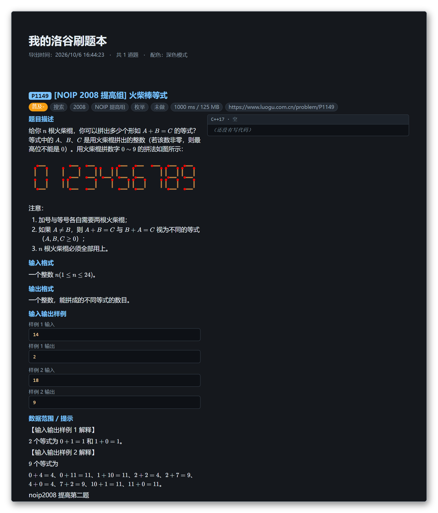
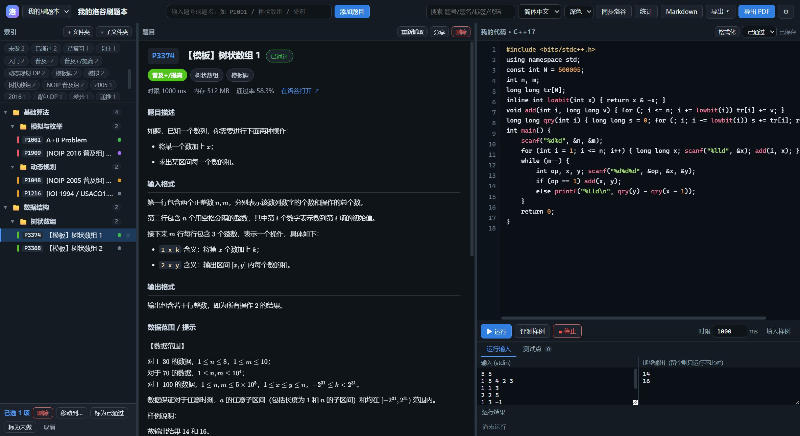
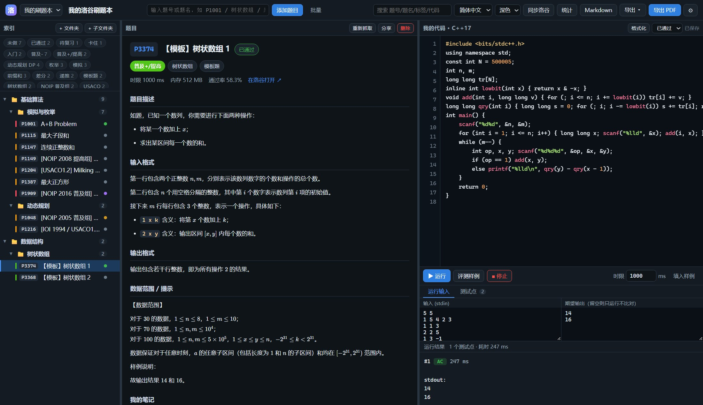
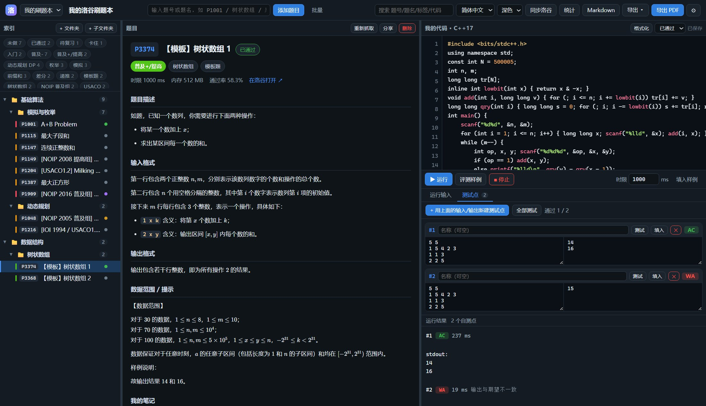
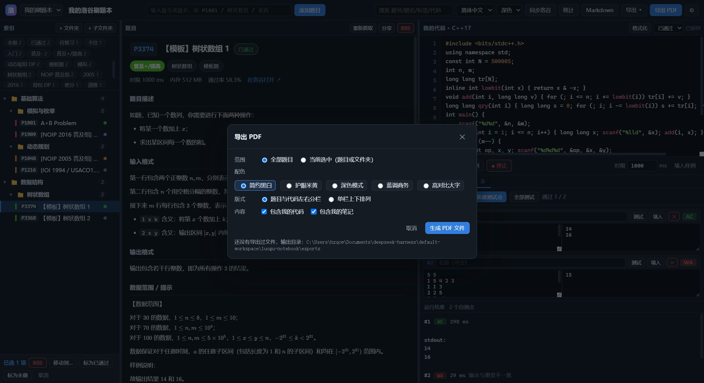
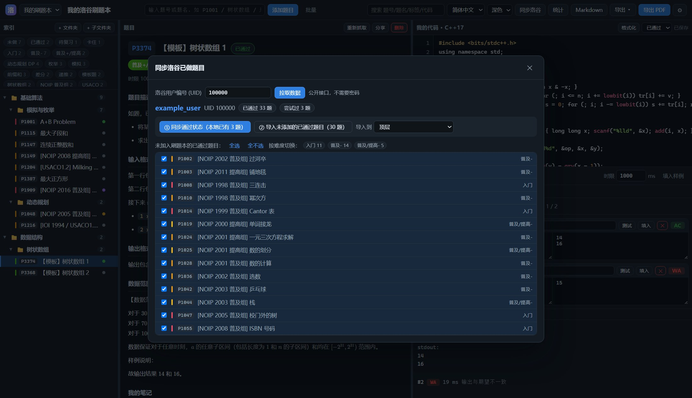
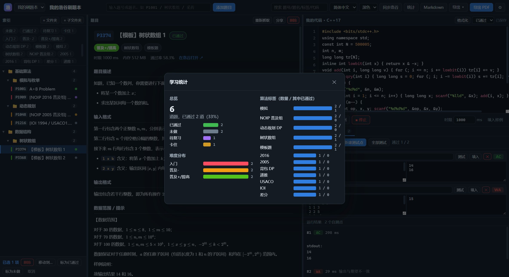
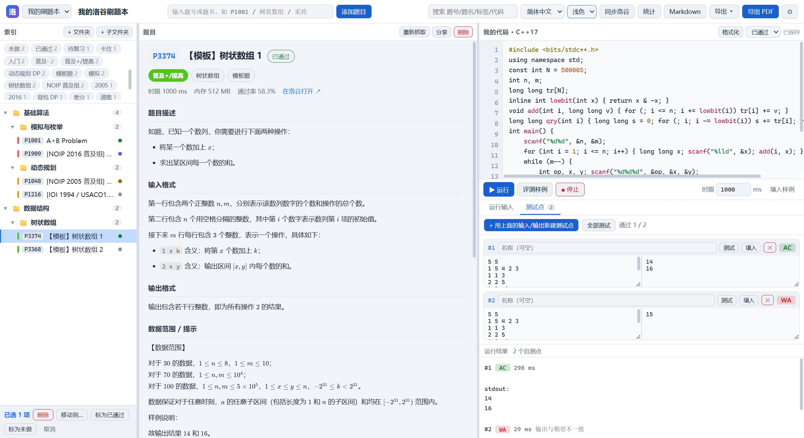
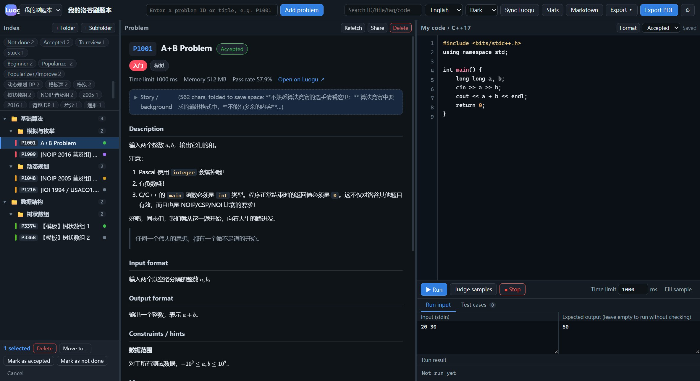

# 洛谷刷题本

一个放在**自己电脑上**的刷题记录本。把洛谷的题目收进来，用文件夹整理好，写代码、跑测试，最后导成 PDF 或图片保存、分享。

- 不用登录、不用注册，**数据全在自己硬盘上**
- 断网也能看题、写代码（题面是抓下来存在本地的）
- 不想用了，删掉文件夹就干净了，不会在系统里留东西

> 当前版本 **v1.2.0**

---

## 怎么开始

### 1. 装 Node.js
去 <https://nodejs.org/> 下载安装（选左边的 LTS 版本，一路下一步就行）。

### 2. 启动
- **Windows**：双击 `start.bat`
- **Mac / Linux**：终端里 `./start.sh`（第一次可能要 `chmod +x start.sh`）

会弹出一个黑色小窗口，同时浏览器自动打开。**那个黑窗口不要关**，关了程序就停了。

### 3. 第一次打开会带你配环境
程序会自己检查「能不能编译运行代码」「能不能导出 PDF」，缺什么点一下按钮就能装好。什么都不配也能用，只是跑不了代码、导不了 PDF。

### 想要一个桌面图标？（可选）
在浏览器地址栏右边找到「安装」图标，点一下就有独立窗口和桌面图标了，以后不用再对着黑窗口。
（Edge 和 Chrome 都支持；找不到的话在浏览器菜单里选 `应用 → 安装此站点为应用`。）

---

## 它能帮你做什么

**收题**
- 输入题号（`P1001`）或题名（`采药`）就能把题目收进本子，标题、难度、算法标签、输入输出格式、样例、时限都自动填好
- 一次加几十道：把一串题号粘进去（逗号、空格、换行、洛谷链接都认）
- 整个题单一次导入：填题单号（比如 `117`），自动建一个以题单命名的文件夹，题目按原顺序排好
- 「同步洛谷」填上你的 UID（不用密码），能把账号里已通过的题目批量拉进来

**整理**
- 文件夹可以随便嵌套，拖动就能挪位置
- 空白处按住鼠标一拉就能框选一堆题，批量删除、移动、改状态
- 索引还能一键切换成 **按算法** 或 **按比赛** 看（像洛谷官网那样分类），看完可以「整理成文件夹」变回真实文件夹

**写代码**
- 右边是带高亮的代码编辑器，支持 Tab 缩进、括号自动配对
- 「格式化」按钮能自动把代码排整齐
- 「历史」按钮给每道题存多个版本，能对比改了哪里、一键恢复；**测试全过时会自动存一版**

**测试**
- `▶ 运行`：跑你自己填的输入
- `评测样例`：用洛谷的样例逐点比对，全对就自动标成「已通过」
- 「测试点」页签：把数据存成多组，一键全测，每个点单独显示对错和耗时

**导出与分享**
- **PDF**：可以只导一道题，也可以把整个本子导成一本册子（每道题自动排在一页内，不会拦腰截断）
- **Markdown**：导成一篇文字稿，适合放到博客或笔记软件里
- **PNG 图片**：把某道题做成一张卡片图片，直接发群里
- 五种 PDF 配色可选：简约黑白 / 护眼米黄 / 深色模式 / 蓝调商务 / 高对比大字

**其他**
- 界面配色三套（深色 / 浅色 / 琥珀），语言支持 简体中文 / 繁體中文 / English，选过就记住
- 「学习统计」可以看自己做了多少、各难度和算法分布
- 顶部还能全文搜索：题号、题名、标签、代码、笔记都能搜

## 界面长什么样



<table>
  <tr>
    <td width="50%"><br><sub>左边整理题目，中间看题，右边写代码</sub></td>
    <td width="50%"><br><sub>跑样例，对错和耗时一目了然</sub></td>
  </tr>
  <tr>
    <td><br><sub>自己攒多组测试数据，一键全测</sub></td>
    <td><br><sub>导出成册，题目和代码并排</sub></td>
  </tr>
  <tr>
    <td><br><sub>填 UID 就能同步账号进度</sub></td>
    <td><br><sub>看看自己都做了些什么</sub></td>
  </tr>
  <tr>
    <td><br><sub>三套界面配色</sub></td>
    <td><br><sub>三种界面语言</sub></td>
  </tr>
</table>

---

## 我的数据在哪？会不会丢？

**所有东西都在程序目录里的 `data/` 文件夹**，就是普通的文件，你可以随时复制、备份、拷到别的电脑。

| 想做什么 | 怎么做 |
| --- | --- |
| 备份一下 | 把整个 `data/` 复制到别的地方（U 盘、网盘都行） |
| 一键完整备份 | 界面里 `导出 → 备份与恢复…`，连题面图片一起打包 |
| 换电脑 | 新电脑装好后，把旧的 `data/` 拷过去，或者用 `导出 → 从旧目录导入数据…` 让它自己找 |
| 升级新版本 | 把新版本**解压覆盖**到原来的文件夹就行，`data/` 不会被碰 |

**升级时请注意**：一定要「解压覆盖到原来的文件夹」，不要解压到一个新文件夹直接用 —— 那样打开是空的（数据没丢，还在旧文件夹里，但容易吓一跳）。

程序本身也做了不少保护：每次保存前会留一份上一版、每 10 分钟自动存档一次、文件万一坏了会先留档再从 Markdown 重建、开了两个窗口同时改会拒绝互相覆盖。所以正常使用基本不用担心丢数据。

## 忘了或者搞错了怎么办

- **误删了东西**：按 `Ctrl+Z` 撤销（删除、移动、批量改状态都能撤销，最多 40 步）
- **升级后打开是空的**：数据还在旧文件夹里。把旧的 `data/` 拷过来，或用 `导出 → 从旧目录导入数据…`
- **页面上提示「笔记本文件损坏，已从 .md 恢复」**：程序已经把坏掉的文件改名留档（不会被覆盖），并用 Markdown 备份重建了。缺的字段可以从那个 `.broken-` 开头的文件里手工找回来
- **提示「检测到另一个实例」**：多半是之前没关掉的窗口，把多余的关掉即可
- **抓题失败 / 老是让人机验证**：洛谷有反爬，等几秒再试
- **题面图片显示不出来**：把 `data/images/` 里对应题号的文件夹删掉，再点「重新抓取」
- **批量加题很慢**：勾了「立即抓取题面」就是一题一题抓，50 道大概 1 分钟；不勾会立刻加好，题面等你打开时再补
- **题单导不进来**：只能导**公开题单**。私有的会提示需要登录
- **同步提示隐私问题**：去洛谷「设置 → 隐私」里把练习数据设为公开
- **跑代码报错找不到编译器**：点右上角 ⚙ 确认 `g++.exe` 的路径填对了
- **导出 PDF 失败**：多半是没装 Edge/Chrome。用 `start.bat` 正常启动一般就没问题
- **程序卡住不输出**：点 `■ 停止`，评测本身也有超时保护
- **浏览器打不开**：看黑窗口里打印的地址，端口被占用时它会自动往后找一个

---

## 发给别人用

打包一个干净的压缩包（**不含**你自己的数据）：

```bash
node tools/package.mjs
```

会在 `dist/` 里生成 `luogu-notebook-v1.2.0.zip`。对方解压后双击 `start.bat` 就能用，第一次打开有向导带着配环境。

## 需要装什么

| 用途 | 需要 | 没有会怎样 |
| --- | --- | --- |
| 运行程序 | Node.js 20 或更新 | 启动时会提示你去官网装 |
| 跑代码 | 一个 C++ 编译器（g++） | 只能看题不能跑；向导里可以手动指定路径 |
| 导出 PDF | 电脑上的 Edge 或 Chrome | 导不了 PDF，其他功能照常 |
| 代码格式化 | clang-format（可选） | 点「格式化」时会提示去哪下载 |

> 编译器用哪来的都行：MinGW-w64、MSYS2、小熊猫 RedPanda-CPP 自带的都可以，向导能自动认出来。

---

<details>
<summary><b>给懂点技术的人看（不想看可以跳过）</b></summary>

**怎么做的**：一个只用 Node.js 内置模块的小服务（没有任何第三方依赖），前端是几个普通的 JS 文件，字体库、Markdown 解析、公式渲染这些都已经放进 `public/vendor/`，所以断网可用。数据存成 JSON，同时自动导出一份 Markdown 方便你用别的工具处理。PDF 是调用系统自带的 Edge/Chrome 无头模式渲染的，中文、公式、代码高亮都是矢量的，文字能选中能搜索。

**目录结构**：

```
luogu-notebook/
├─ start.bat / start.sh   启动脚本
├─ server.mjs             后端服务
├─ lib/                   抓题、评测、格式化、存档、PDF 各一块
├─ public/                界面（含 public/vendor/ 离线依赖）
├─ data/                  ★ 你的数据
│  ├─ notebooks/          结构化数据（唯一数据源）+ 自动导出的 .md
│  ├─ images/             题面图片
│  ├─ snapshots/          代码历史版本
│  └─ backups/            完整备份 / 自动存档
├─ exports/               导出的 PDF / Markdown / 图片
└─ tools/                 自测与打包脚本
```

**自测脚本**（改完代码可以跑一遍）：

```bash
node tools/build-i18n.mjs        # 重新生成多语言文件并校验三种语言没漏翻
node tools/test-roundtrip.mjs    # 数据与 Markdown 互相转换不丢东西
node tools/test-safety.mjs       # 数据安全：损坏恢复、备份、冲突保护（32 项）
node tools/test-pdf-markdown.mjs # 打印页确实渲染了 Markdown（10 项）
node tools/test-print-css.mjs    # 打印排版几何
node tools/test-pwa.mjs          # 桌面应用安装能力
node tools/test-exports.mjs      # 导出：Markdown / PNG / 历史
node tools/test-history.mjs      # 代码版本历史
node tools/test-toc.mjs          # PDF 目录页与书签
node tools/test-index-views.mjs  # 按算法 / 按比赛 两种索引视图
node tools/test-training.mjs     # 题单导入（需要联网）
node tools/test-i18n.mjs         # 界面语言切换
node tools/ui-test.mjs           # 界面端到端（无头浏览器）
node tools/package.mjs           # 打包
```

**说明**：洛谷的官方测试数据不公开（记录页要登录、没有 testdata 接口），所以本工具不做代提交，只用「洛谷样例 + 自建测试点」满足本地验证。账号同步只读公开的练习数据，不需要密码、不存凭据。本工具与洛谷官方无关，请遵守洛谷的用户协议。

</details>

---

本项目主要由 AI 工具 DeepSeek V4.1 Flash 生成，人工做了整理、配置和测试。按“原样”提供，不保证完全适合所有场景。

MIT License
